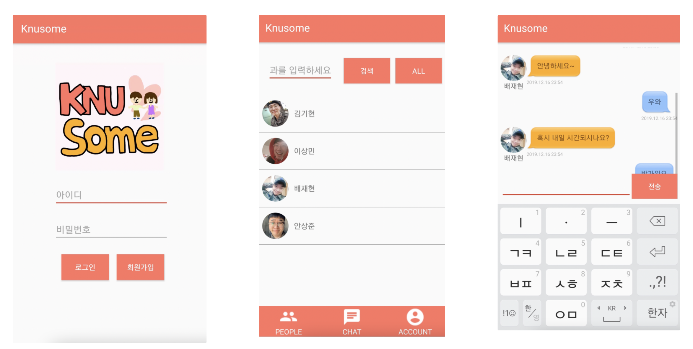
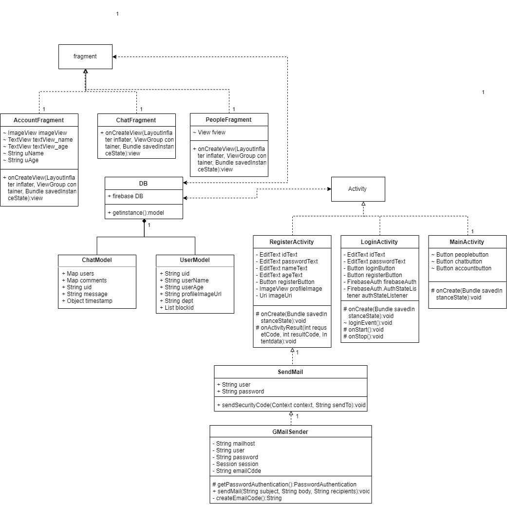

# KNUsome
경북대학교 학생들을 대상으로하는 소개팅 어플리케이션입니다. Firebase를 활용해 학생들의 정보를 저장하고 실시간 대화 서비스를 구축하였습니다.

## 컴포넌트
>-  android studio
>- firebase (cloud service)

## requirements

>- [요구사항분석](img/Requirements.pdf)

## Class Diagram

## 시스템 설명
1. 회원가입
- 프로필 이미지 선택
- knu아이디로 이메일 인증
- 비밀번로, 나이, 성별, 과 를 입력

2. 로그인
- 회원가입한 아이디로 로그인

### fragment
> ### people
>3. 프로필 출력
>- 자신의 성별과 반대되는 성별의 사람들의 프로필을 보여줌
>- 마음에 드는 상대의 프로필을 누르면 상대의 정보가 나오고(이름,나이,학과) 대화 혹은 차단을 할 수 있다.
> 4. 검색기능
>- 과를 입력후 검색가능
>- 검색 후 all 버튼을 통해 다시 전부 출력가능하다.

>### chat
> 5. 채팅방 목록
>- 현재 채팅중인 채팅방 목록을 볼 수 있다.
> 6. 채팅방
>- 채팅방을 클릭하거나 poeple fragment에서 마음에 드는 상대와 대화를 누르면 그 상대와의 채팅방으로 들어갈 수 있다.
>- 채팅메세지를 입력 후 전송버튼을 통해 메세지를 전달할 수 있고 나의 채팅을 파란색 말풍선으로 상대의 채팅은 노란색 말풍선으로 표시된다.
>- 상대의 채팅에는 상대방의 프로필과 이름, 채팅을 보낸시간을 표시한다.

>### account
>- 자신의 프로필사진, 이름, 나이, 학과, 성별을 볼 수 있다.
>- 탈퇴버튼을 통해 탈퇴가 가능하다.

## 데모
- https://youtu.be/JwZXRSXmsdQ

## contributor
- 배재현
- 안상준
- 이상민
- 장지현
- 정혜진